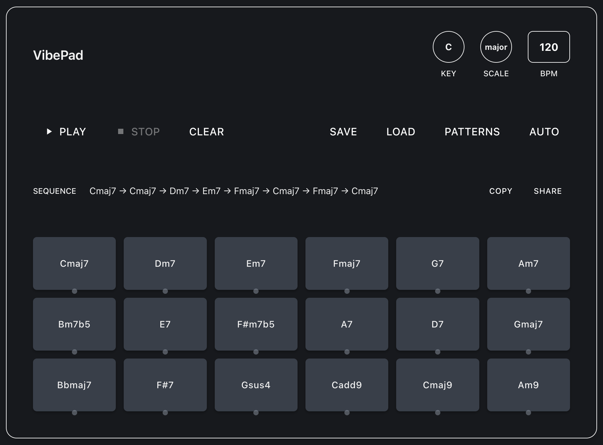

# Vibepad

A browser‑based chord pad for rapid prototyping of chord progressions.  Built with Next.js 15, React 19, Tone.js, and Tailwind CSS 4.  You can audition, record, and share harmonic ideas straight from the browser—no DAW required.



## Features

- **Any Key / Five Modes**  – Transpose the factory "C" map to any diatonic key and switch between `major`, `minor`, `dorian`, `mixolydian`, and `lydian` scales.
- **Responsive Chord Pad**  – All scale‑appropriate chords are auto‑laid out in a responsive grid (≈18 pads).  Click a pad to play the chord.
- **Poly Synth Engine**     – `Tone.PolySynth → HPF → Limiter → Destination`, 8 voices, triangle waveform.
- **Tempo Control**         – Type a value or drag vertically (60‑240 BPM).  Loop timing updates in real‑time.
- **Record & Loop**         – Every pad trigger is captured; hit *PLAY* to loop the sequence at the current BPM.
- **16 Progression Presets** – Classic pop, jazz, Andalusian, blues, etc.  Choose from a modal or generate one at random.
- **Share / Save**          – Progressions are encoded into the URL for quick sharing, and can be saved to `localStorage`.
- **Dark, Mobile‑first UI** – Tailwind CSS 4 theme, scales from phone to desktop.

## Getting Started

```bash
# clone & install
git clone https://github.com/yourname/vibepad.git
cd vibepad
npm install

# dev server (Turbopack)
npm run dev
```

Open http://localhost:3000 and start jamming 🎛️🎹.

## Roadmap

- Add the remaining modes (phrygian, locrian) & non‑diatonic borrowed chords
- MIDI‑out and WebMIDI learn
- Export as MIDI file
- Touch‑friendly XY‑Pad for velocity / filter sweeps

## Author

Kentaro Kuribayashi

## License

MIT License
